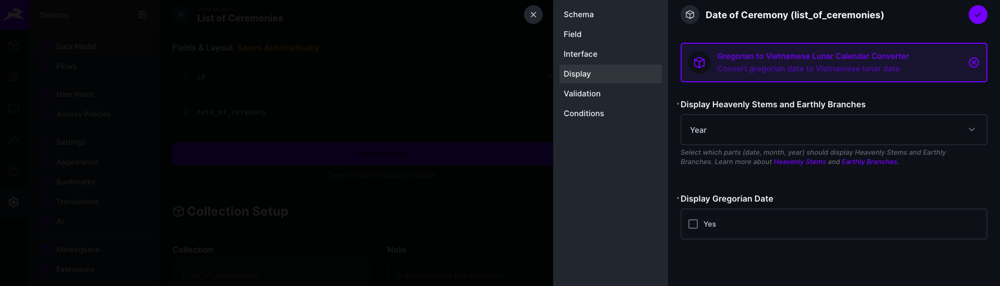
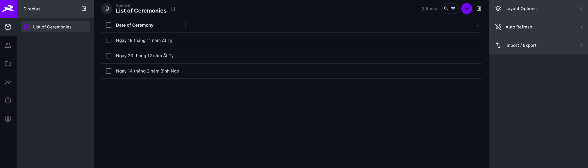

# Lunar Date Converter

A Directus display extension that converts Gregorian dates to Vietnamese lunar calendar dates with support for Heavenly Stems and Earthly Branches (Can Chi) system.

This extension is built using the [@dqcai/vn-lunar](https://github.com/cuongdqpayment/dqcai-vn-lunar) library by [cuongdqpayment](https://github.com/cuongdqpayment). 

## Description

This extension provides a custom display format for date fields in Directus, showing Vietnamese lunar calendar dates with optional Heavenly Stems and Earthly Branches (Can Chi) formatting. It allows you to customize which parts of the date (day, month, year) should display using the traditional Can Chi system.

## Features

- **Dual Calendar Display**: Shows both Gregorian and Vietnamese lunar calendar dates
- **Heavenly Stems and Earthly Branches (Can Chi)**: Optional display of traditional Vietnamese date formatting for day, month, and/or year
- **Flexible Configuration**: Choose which parts (date, month, year) should use Can Chi formatting
- **Toggle Gregorian Date**: Option to show or hide the Gregorian date

## Requirements

- Directus 10.10.0 or higher
- Node.js 22 or higher (for building)

## Installation

1. Copy this extension to your Directus extensions directory:
   ```bash
   cp -r directus-extension-vietnamese-lunar-date-converter /path/to/directus/extensions/
   ```

2. Install dependencies:
   ```bash
   cd extensions/directus-extension-vietnamese-lunar-date-converter
   npm install
   ```

3. Build the extension:
   ```bash
   npm run build
   ```

4. Restart Directus or ensure `EXTENSIONS_AUTO_RELOAD` is enabled in your environment variables.

## Usage

1. Go to **Settings** → **Data Model** in your Directus admin panel
2. Navigate to your collection
3. Click on the date field you want to customize
4. In the **Display** dropdown, select **"Gregorian to Vietnamese Lunar Calendar Converter"**
5. Configure the display options:
   - **Display Heavenly Stems and Earthly Branches**: Select which parts (Date, Month, Year) should use Can Chi formatting
   - **Display Gregorian Date**: Toggle to show or hide the Gregorian date
6. Save the field settings



## Configuration Options

### Display Heavenly Stems and Earthly Branches

A multi-select dropdown that allows you to choose which parts of the lunar date should display using the Can Chi system:

- **Date**: Display the day using Heavenly Stems and Earthly Branches
- **Month**: Display the month using Heavenly Stems and Earthly Branches
- **Year**: Display the year using Heavenly Stems and Earthly Branches

You can select any combination of these options, or none at all.

### Display Gregorian Date

A boolean toggle that controls whether the Gregorian date is displayed:
- **Enabled**: Shows the Gregorian date in the format `DD/MM/YYYY Dương Lịch`
- **Disabled**: Only shows the lunar date

## Display Format

The extension displays dates in the following format:

**When Gregorian date is enabled:**
```
06/01/2026 Dương Lịch
Ngày 18 tháng 11 năm Bính Ngọ
```

**When Gregorian date is disabled:**
```
Ngày 18 tháng 11 năm Bính Ngọ
```



## Development

### Build

```bash
npm run build
```

### Development Mode

Watch for changes and rebuild automatically:

```bash
npm run dev
```

## Dependencies

- `@dqcai/vn-lunar`: Vietnamese lunar calendar conversion library
- `@directus/extensions-sdk`: Directus extensions SDK
- `vue`: Vue.js framework
- `typescript`: TypeScript support

## Project Structure

```
directus-extension-vietnamese-lunar-date-converter/
├── src/
│   ├── display.vue      # Main display component
│   ├── index.ts         # Extension entry point
│   └── shims.d.ts       # TypeScript declarations
├── dist/                # Built extension (generated)
├── package.json
├── tsconfig.json
└── README.md
```

